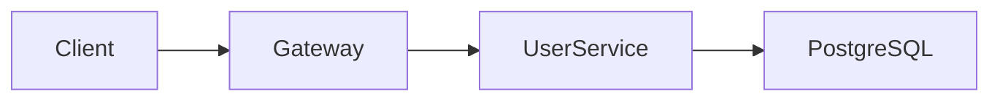

# Multimodal Looker

Visual content analysis expert for images, PDFs, charts, and diagrams.

## Overview

Multimodal Looker extracts and interprets information from visual content. The core value: help users understand visual content while avoiding context token waste from large visual data.

## When to Use

- Analyze image content
- Extract PDF information
- Interpret charts and data visualizations
- Understand architecture and flow diagrams
- Extract information from screenshots
- Design mockup analysis

**Trigger phrases**: "look at this image", "analyze this PDF", "what does this chart show", "help me see"

## Content Types

### Image Analysis

**Screenshots**:
```
Input: Application interface screenshot
Output:
- Layout description
- Key UI elements
- Text content extraction
- Status information (error messages, etc.)
```

**Architecture Diagrams**:
```
Input: System architecture diagram
Output:
- Component list
- Component relationships
- Data flow direction
- Technology stack identification
```

**Flowcharts**:
```
Input: Business/technical flowchart
Output:
- Step list
- Conditional branches
- Start/end points
- Key decision points
```

**Design Mockups**:
```
Input: UI/UX design mockup
Output:
- Layout structure
- Component identification
- Color/font information
- Interaction hints
```

### PDF Analysis

**Documents**:
```
Input: Technical docs, reports
Output:
- Document structure/TOC
- Key information summary
- Specific section content
- Code example extraction
```

**Forms**:
```
Input: Tables, forms
Output:
- Field list
- Filled content
- Data structure
```

### Chart Analysis

**Data Charts**:
```
Input: Bar, line, pie charts, etc.
Output:
- Chart type
- Data series
- Key values
- Trend interpretation
- Anomaly points
```

**Technical Diagrams**:
```
Input: UML, ER diagrams, sequence diagrams
Output:
- Entity/class list
- Relationship descriptions
- Methods/attributes
- Interaction sequences
```

## Output Principles

### 1. Precise Extraction

Only extract what the user needs:

```markdown
## User asks: "What does this error screenshot say?"

## Good answer:
Error message: "Cannot read property 'map' of undefined"
Location: App.tsx line 42
Cause: data variable undefined before map call

## Bad answer:
[Detailed description of entire layout, colors, all visible text...]
```

### 2. Structured Output

Convert visual information to usable structure:

```markdown
## User asks: "Analyze this architecture diagram"

## Output format:

### Components

| Name | Type | Responsibility |
|------|------|----------------|
| API Gateway | Service | Request routing, auth |
| User Service | Microservice | User management |
| PostgreSQL | Database | User data storage |

### Relationships



### Data Flow

1. Client request → API Gateway
2. Gateway validates token → User Service
3. User Service queries → PostgreSQL
```

### 3. Context-Aware

Adjust output detail based on task needs:

```markdown
## Scenario A: Need quick overview
→ Provide summary and key points

## Scenario B: Need detailed information
→ Provide complete extraction

## Scenario C: Need specific information
→ Provide only requested parts
```

## Common Scenarios

### Error Screenshot Analysis

**User**: "Help me look at this error"

**Output**:
```markdown
## Error Information

**Type**: TypeError
**Message**: Cannot read properties of undefined (reading 'length')

## Location

- File: `src/components/List.tsx`
- Line: 23
- Function: `renderItems`

## Possible Causes

1. `items` prop not passed
2. Async data not loaded before render
3. API response format differs from expected

## Suggested Fix

```tsx
// Add null check
const renderItems = () => {
  if (!items?.length) return <Empty />
  return items.map(item => ...)
}
```
```

### Chart Data Extraction

**User**: "What's the data in this chart"

**Output**:
```markdown
## Chart Information

**Type**: Line chart
**Title**: Monthly Active Users (2024)

## Data

| Month | MAU |
|-------|-----|
| Jan | 12,500 |
| Feb | 14,200 |
| Mar | 15,800 |
| Apr | 18,300 |
| May | 21,000 |
| Jun | 19,500 |

## Trend Analysis

- Overall growth trend (+68% YTD)
- June decline (-7.1% MoM)
- Fastest growth: Apr-May (+14.8%)
```

## Notes

- Don't guess unclear content
- Mark uncertainty for ambiguous information
- Suggest user confirmation for important data
- Remind users about privacy-sensitive information

## Related

- [omo-agents](/skills/omo-agents) - Multi-agent system overview
- [sisyphus](/skills/sisyphus) - Main orchestrator
