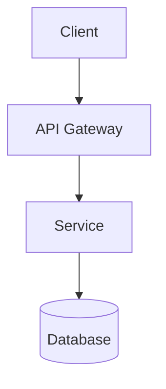
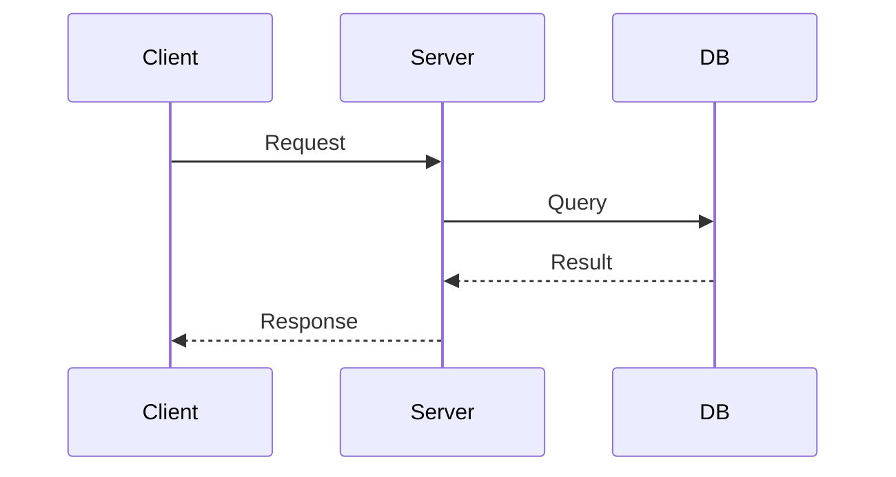
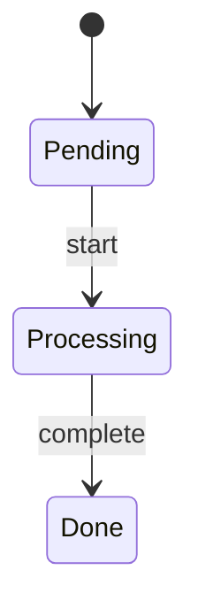

# tech-design-doc

Generate technical design documents with proper structure and diagrams.

## Use Cases

- Designing new features or systems
- Architecture Decision Records (ADR/RFC)
- Planning refactoring or optimization

## Complexity Levels

| Level | Scope | Sections |
|-------|-------|----------|
| Small | Single component, <100 LOC | TL;DR, Design, Implementation |
| Medium | Cross-component, API changes | + Background, Solution Analysis |
| Large | System-level, new service | Full template |

## Document Template

```markdown
# [Feature] Technical Design

## TL;DR
- Problem, solution, key decisions, expected outcome

## Background
### Current State
### Problem Statement
### Goals / Non-Goals

## Solution Analysis
### Option 1: [Name]
### Option 2: [Name]
### Comparison Table
### Recommendation

## Detailed Design
### Architecture
### Component Design
### Data Model
### API Design

## Implementation Plan
### Phase 1
### Migration Strategy

## Risk Assessment
| Risk | Probability | Impact | Mitigation |

## References
```

## Diagrams

### Architecture


### Sequence


### State


## Verification Checklist

- [ ] Problem clearly defined
- [ ] Options compared with trade-offs
- [ ] Decision rationale documented
- [ ] Diagrams illustrate key flows
- [ ] Implementation steps are actionable
- [ ] Risks identified with mitigations

## Output

- Location: `docs/`, `ai_docs/`, or `design/`
- Filename: `design-[feature-name].md`
