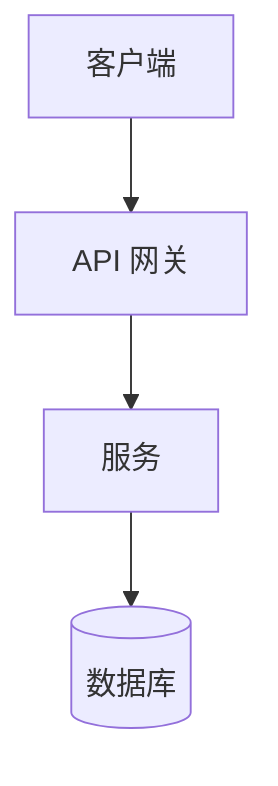
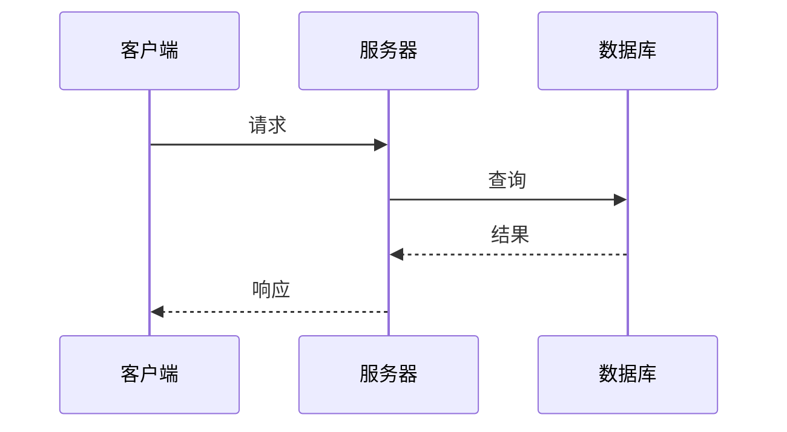
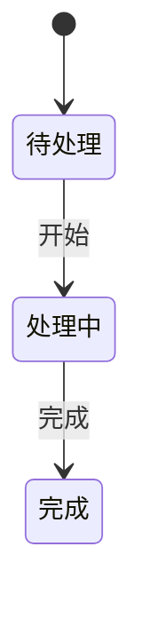

# tech-design-doc

生成结构化的技术设计文档。

## 使用场景

- 设计新功能或系统
- 架构决策记录（ADR/RFC）
- 规划重构或优化工作

## 复杂度级别

| 级别 | 范围 | 章节 |
|------|------|------|
| 小型 | 单组件，<100 行代码 | TL;DR、设计、实现 |
| 中型 | 跨组件，API 变更 | + 背景、方案分析 |
| 大型 | 系统级，新服务 | 完整模板 |

## 文档模板

```markdown
# [功能] 技术设计

## TL;DR
- 问题、方案、关键决策、预期结果

## 背景
### 现状
### 问题陈述
### 目标 / 非目标

## 方案分析
### 方案 1：[名称]
### 方案 2：[名称]
### 对比表格
### 建议

## 详细设计
### 架构
### 组件设计
### 数据模型
### API 设计

## 实现计划
### 阶段 1
### 迁移策略

## 风险评估
| 风险 | 概率 | 影响 | 缓解措施 |

## 参考文献
```

## 图表

### 架构图


### 时序图


### 状态图


## 验证清单

- [ ] 问题定义清晰
- [ ] 方案对比有权衡
- [ ] 决策理由有记录
- [ ] 图表说明关键流程
- [ ] 实现步骤可操作
- [ ] 风险已识别并有缓解措施

## 输出

- 位置：`docs/`、`ai_docs/` 或 `design/`
- 文件名：`design-[feature-name].md`
