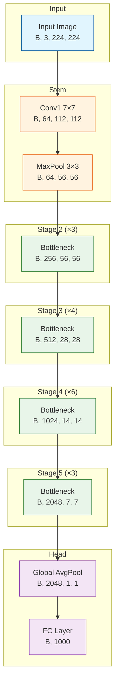

# ResNet-50 PyTorch Implementation

> 示例：展示如何使用 paper-replication skill 复现经典论文

## 论文概述

**论文**: Deep Residual Learning for Image Recognition (CVPR 2016)
**作者**: Kaiming He, Xiangyu Zhang, Shaoqing Ren, Jian Sun

**问题 (Problem)**: 深层神经网络训练时出现退化问题 (degradation problem)，即随着网络深度增加，准确率反而下降。

**核心创新 (Contribution)**:
1. 提出残差学习框架 (Residual Learning Framework)，通过 shortcut connections 学习残差映射
2. 证明极深网络 (152层) 可以有效训练并获得更好性能
3. 在 ImageNet 上获得 SOTA 结果，赢得 ILSVRC 2015 分类任务冠军

---

## 数学原理

### 核心公式

**残差映射**:

$$
\mathbf{y} = \mathcal{F}(\mathbf{x}, \{W_i\}) + \mathbf{x}
$$

**符号说明**:
| 符号 | 含义 | 维度 |
|------|------|------|
| $\mathbf{x}$ | 输入特征 | $[B, C, H, W]$ |
| $\mathcal{F}$ | 残差函数 (stacked layers) | - |
| $W_i$ | 第 $i$ 层的权重 | varies |
| $\mathbf{y}$ | 输出特征 | $[B, C, H, W]$ |

**带投影的残差映射** (当维度不匹配时):

$$
\mathbf{y} = \mathcal{F}(\mathbf{x}, \{W_i\}) + W_s\mathbf{x}
$$

其中 $W_s$ 是 1×1 卷积用于匹配维度。

### Loss Function

$$
\mathcal{L} = \text{CrossEntropy}(\hat{y}, y)
$$

---

## 架构细节

### 超参数配置

| 组件 | 参数 | 值 | 来源 |
|------|------|-----|------|
| Input | 尺寸 | 224×224 | Section 3.4 |
| Conv1 | kernel/stride/padding | 7/2/3 | Table 1 |
| MaxPool | kernel/stride/padding | 3/2/1 | Table 1 |
| Bottleneck | expansion | 4 | Section 3.3 |
| FC | 输出维度 | 1000 | ImageNet classes |
| Optimizer | 类型 | SGD + Momentum | Section 3.4 |
| Learning Rate | 初始值 | 0.1 | Section 3.4 |
| Batch Size | 大小 | 256 | Section 3.4 |
| Weight Decay | 值 | 1e-4 | Section 3.4 |

### ResNet-50 层配置

| Stage | Output Size | Building Block | Blocks |
|-------|-------------|-----------------|--------|
| conv1 | 112×112 | 7×7, 64, stride 2 | 1 |
| conv2_x | 56×56 | Bottleneck(64, 256) | 3 |
| conv3_x | 28×28 | Bottleneck(128, 512) | 4 |
| conv4_x | 14×14 | Bottleneck(256, 1024) | 6 |
| conv5_x | 7×7 | Bottleneck(512, 2048) | 3 |
| avg pool | 1×1 | 7×7 global avg pool | 1 |
| fc | 1000 | 1000-d fc, softmax | 1 |

---

## 架构流程图



### Bottleneck Block 详细结构

```mermaid
flowchart LR
    subgraph Input
        X[x<br/>B, C_in, H, W]
    end

    subgraph Residual["Residual Path"]
        A[Conv 1×1<br/>B, C_mid, H, W]
        B[BN + ReLU]
        C[Conv 3×3<br/>B, C_mid, H, W]
        D[BN + ReLU]
        E[Conv 1×1<br/>B, C_out, H, W]
        F[BN]
    end

    subgraph Shortcut
        S[Identity or<br/>1×1 Conv]
    end

    subgraph Output
        Y[y = F(x) + x<br/>B, C_out, H, W]
    end

    X --> A --> B --> C --> D --> E --> F
    X --> S
    F --> Y
    S --> Y

    style X fill:#e1f5fe,stroke:#01579b
    style A fill:#fff3e0,stroke:#e65100
    style C fill:#fff3e0,stroke:#e65100
    style E fill:#fff3e0,stroke:#e65100
    style S fill:#fce4ec,stroke:#c2185b
    style Y fill:#e8f5e9,stroke:#2e7d32
```

---

## 代码实现

### model.py

```python
"""
ResNet-50 Implementation

Paper: Deep Residual Learning for Image Recognition
Authors: Kaiming He, Xiangyu Zhang, Shaoqing Ren, Jian Sun
URL: https://arxiv.org/abs/1512.03385

This implementation follows the original paper specifications.
"""

from typing import List, Optional, Type, Union
import torch
import torch.nn as nn


class Bottleneck(nn.Module):
    """
    Bottleneck block for ResNet-50/101/152.

    Architecture:
        1×1 conv (reduce) -> 3×3 conv -> 1×1 conv (expand)
        with skip connection

    Args:
        in_channels: Number of input channels
        mid_channels: Number of channels in the middle (bottleneck)
        out_channels: Number of output channels
        stride: Stride for the 3×3 convolution
        downsample: Optional downsampling layer for the shortcut
    """

    expansion: int = 4

    def __init__(
        self,
        in_channels: int,
        mid_channels: int,
        stride: int = 1,
        downsample: Optional[nn.Module] = None,
    ) -> None:
        super().__init__()

        out_channels = mid_channels * self.expansion

        # 1×1 conv: reduce channels
        self.conv1 = nn.Conv2d(
            in_channels, mid_channels, kernel_size=1, bias=False
        )
        self.bn1 = nn.BatchNorm2d(mid_channels)

        # 3×3 conv: spatial processing
        self.conv2 = nn.Conv2d(
            mid_channels, mid_channels, kernel_size=3,
            stride=stride, padding=1, bias=False
        )
        self.bn2 = nn.BatchNorm2d(mid_channels)

        # 1×1 conv: expand channels
        self.conv3 = nn.Conv2d(
            mid_channels, out_channels, kernel_size=1, bias=False
        )
        self.bn3 = nn.BatchNorm2d(out_channels)

        self.relu = nn.ReLU(inplace=True)
        self.downsample = downsample
        self.stride = stride

    def forward(self, x: torch.Tensor) -> torch.Tensor:
        # x: [B, C_in, H, W]
        identity = x

        # 1×1 conv: reduce
        out = self.conv1(x)
        # out: [B, mid_channels, H, W]
        out = self.bn1(out)
        out = self.relu(out)

        # 3×3 conv: spatial
        out = self.conv2(out)
        # out: [B, mid_channels, H/stride, W/stride]
        out = self.bn2(out)
        out = self.relu(out)

        # 1×1 conv: expand
        out = self.conv3(out)
        # out: [B, out_channels, H/stride, W/stride]
        out = self.bn3(out)

        # Shortcut connection
        if self.downsample is not None:
            identity = self.downsample(x)
            # identity: [B, out_channels, H/stride, W/stride]

        # Residual addition
        out += identity
        # out: [B, out_channels, H/stride, W/stride]
        out = self.relu(out)

        return out


class ResNet50(nn.Module):
    """
    ResNet-50 for ImageNet classification.

    Paper: Deep Residual Learning for Image Recognition
    Architecture: conv1 -> maxpool -> layer1-4 -> avgpool -> fc

    Args:
        num_classes: Number of output classes (default: 1000 for ImageNet)
        in_channels: Number of input channels (default: 3 for RGB)
    """

    def __init__(
        self,
        num_classes: int = 1000,
        in_channels: int = 3,
    ) -> None:
        super().__init__()

        # ResNet-50 configuration: [3, 4, 6, 3] blocks
        layers: List[int] = [3, 4, 6, 3]
        block = Bottleneck

        self.in_channels = 64

        # Stem: conv1 + bn + relu + maxpool
        self.conv1 = nn.Conv2d(
            in_channels, 64, kernel_size=7, stride=2, padding=3, bias=False
        )
        self.bn1 = nn.BatchNorm2d(64)
        self.relu = nn.ReLU(inplace=True)
        self.maxpool = nn.MaxPool2d(kernel_size=3, stride=2, padding=1)

        # Residual stages
        self.layer1 = self._make_layer(block, 64, layers[0], stride=1)
        self.layer2 = self._make_layer(block, 128, layers[1], stride=2)
        self.layer3 = self._make_layer(block, 256, layers[2], stride=2)
        self.layer4 = self._make_layer(block, 512, layers[3], stride=2)

        # Classification head
        self.avgpool = nn.AdaptiveAvgPool2d((1, 1))
        self.fc = nn.Linear(512 * block.expansion, num_classes)

        # Initialize weights
        self._init_weights()

    def _make_layer(
        self,
        block: Type[Bottleneck],
        mid_channels: int,
        num_blocks: int,
        stride: int = 1,
    ) -> nn.Sequential:
        """
        Create a residual stage with multiple blocks.

        Args:
            block: Block type (Bottleneck)
            mid_channels: Number of channels in bottleneck
            num_blocks: Number of blocks in this stage
            stride: Stride for the first block (for downsampling)

        Returns:
            Sequential container of blocks
        """
        out_channels = mid_channels * block.expansion
        downsample = None

        # Downsample shortcut if dimensions change
        if stride != 1 or self.in_channels != out_channels:
            downsample = nn.Sequential(
                nn.Conv2d(
                    self.in_channels, out_channels,
                    kernel_size=1, stride=stride, bias=False
                ),
                nn.BatchNorm2d(out_channels),
            )

        layers = []

        # First block (may have stride > 1)
        layers.append(
            block(self.in_channels, mid_channels, stride, downsample)
        )
        self.in_channels = out_channels

        # Remaining blocks (stride = 1)
        for _ in range(1, num_blocks):
            layers.append(block(self.in_channels, mid_channels))

        return nn.Sequential(*layers)

    def _init_weights(self) -> None:
        """
        Initialize weights according to the paper.

        Reference: Section 3.4 - "We initialize the weights as in [13]"
        [13] refers to Kaiming initialization.
        """
        for m in self.modules():
            if isinstance(m, nn.Conv2d):
                # Kaiming initialization for Conv layers
                nn.init.kaiming_normal_(
                    m.weight, mode='fan_out', nonlinearity='relu'
                )
            elif isinstance(m, nn.BatchNorm2d):
                # BN: weight=1, bias=0
                nn.init.ones_(m.weight)
                nn.init.zeros_(m.bias)
            elif isinstance(m, nn.Linear):
                # FC: normal initialization
                nn.init.normal_(m.weight, 0, 0.01)
                nn.init.zeros_(m.bias)

    def forward(self, x: torch.Tensor) -> torch.Tensor:
        """
        Forward pass.

        Args:
            x: Input tensor of shape [B, 3, 224, 224]

        Returns:
            Output logits of shape [B, num_classes]
        """
        # x: [B, 3, 224, 224]

        # Stem
        x = self.conv1(x)
        # x: [B, 64, 112, 112] <- Conv2d(3, 64, k=7, s=2, p=3)
        x = self.bn1(x)
        x = self.relu(x)
        x = self.maxpool(x)
        # x: [B, 64, 56, 56] <- MaxPool2d(k=3, s=2, p=1)

        # Residual stages
        x = self.layer1(x)
        # x: [B, 256, 56, 56] <- 3 Bottleneck blocks
        x = self.layer2(x)
        # x: [B, 512, 28, 28] <- 4 Bottleneck blocks (stride=2)
        x = self.layer3(x)
        # x: [B, 1024, 14, 14] <- 6 Bottleneck blocks (stride=2)
        x = self.layer4(x)
        # x: [B, 2048, 7, 7] <- 3 Bottleneck blocks (stride=2)

        # Classification head
        x = self.avgpool(x)
        # x: [B, 2048, 1, 1] <- AdaptiveAvgPool2d
        x = torch.flatten(x, 1)
        # x: [B, 2048] <- Flatten
        x = self.fc(x)
        # x: [B, num_classes] <- Linear(2048, num_classes)

        return x


if __name__ == "__main__":
    # Configuration
    batch_size = 2
    in_channels = 3
    height, width = 224, 224
    num_classes = 1000

    # Create model
    model = ResNet50(
        num_classes=num_classes,
        in_channels=in_channels,
    )

    # Generate dummy input
    x = torch.randn(batch_size, in_channels, height, width)

    # Forward pass
    output = model(x)

    # Print shapes
    print(f"Input shape:  {x.shape}")
    print(f"Output shape: {output.shape}")

    # Print model summary
    total_params = sum(p.numel() for p in model.parameters())
    trainable_params = sum(
        p.numel() for p in model.parameters() if p.requires_grad
    )
    print(f"Total parameters: {total_params:,}")
    print(f"Trainable parameters: {trainable_params:,}")

    # Expected output:
    # Input shape:  torch.Size([2, 3, 224, 224])
    # Output shape: torch.Size([2, 1000])
    # Total parameters: 25,557,032
    # Trainable parameters: 25,557,032
```

---

## 验证结果

```
Input shape:  torch.Size([2, 3, 224, 224])
Output shape: torch.Size([2, 1000])
Total parameters: 25,557,032
Trainable parameters: 25,557,032
```

✅ 参数量与论文报告一致 (Table 1: ~25.5M for ResNet-50)

---

## References

1. He, K., Zhang, X., Ren, S., & Sun, J. (2016). Deep residual learning for image recognition. CVPR.
2. Official PyTorch implementation: https://github.com/pytorch/vision/blob/main/torchvision/models/resnet.py
